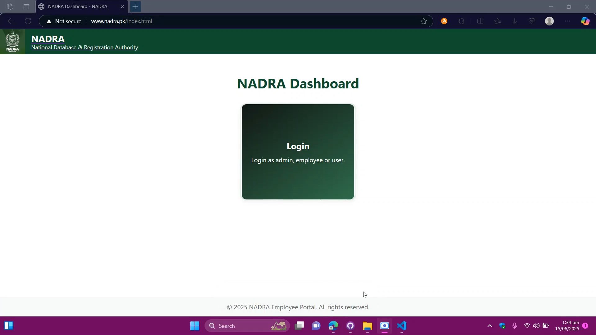
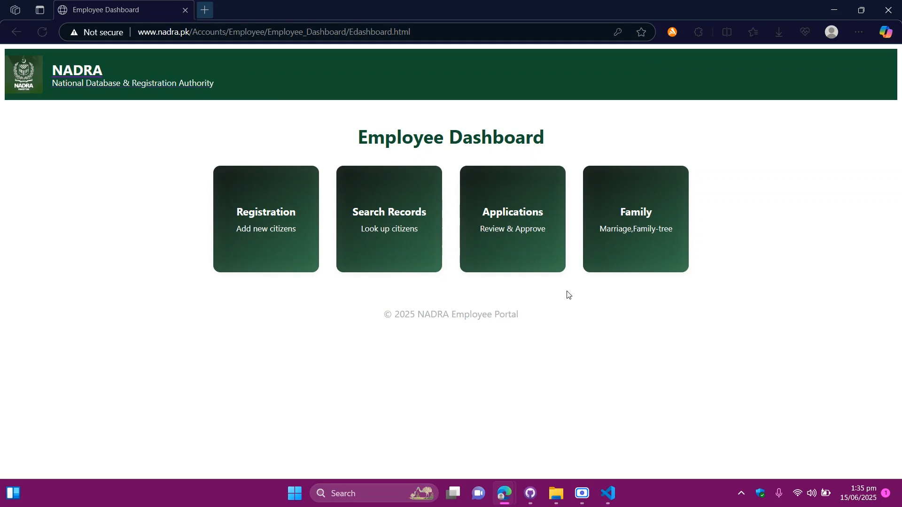
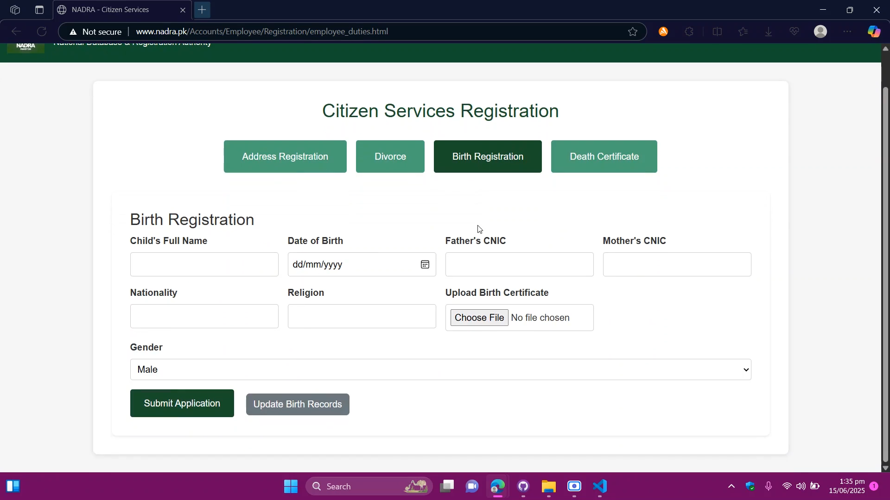
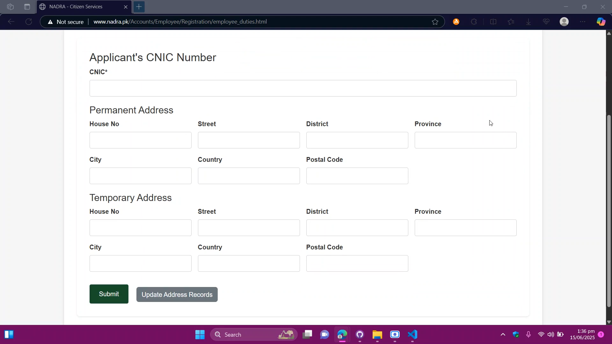
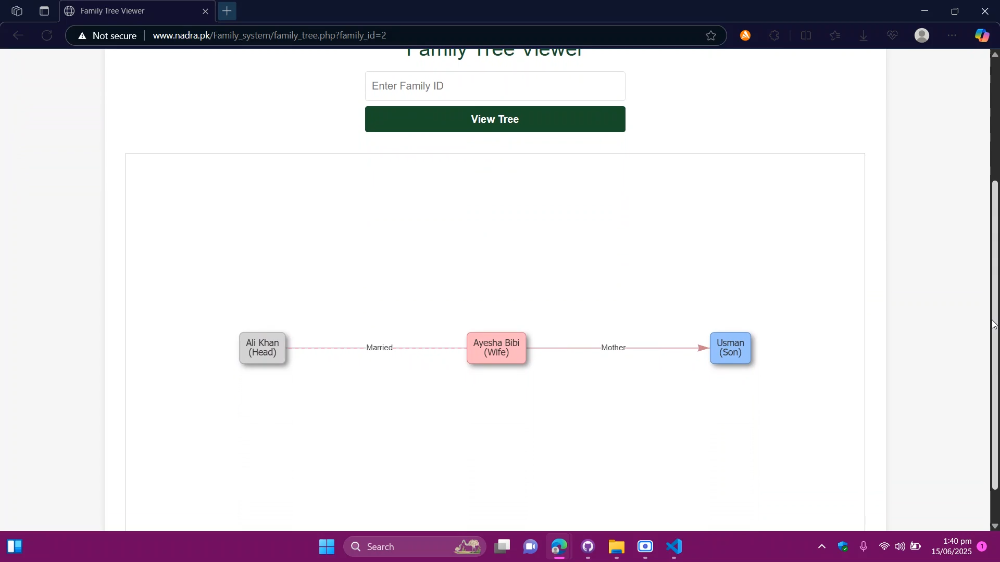
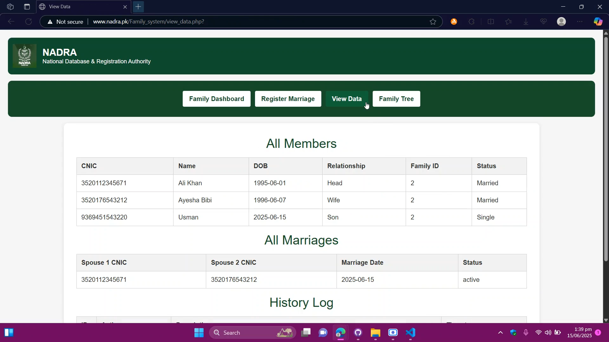
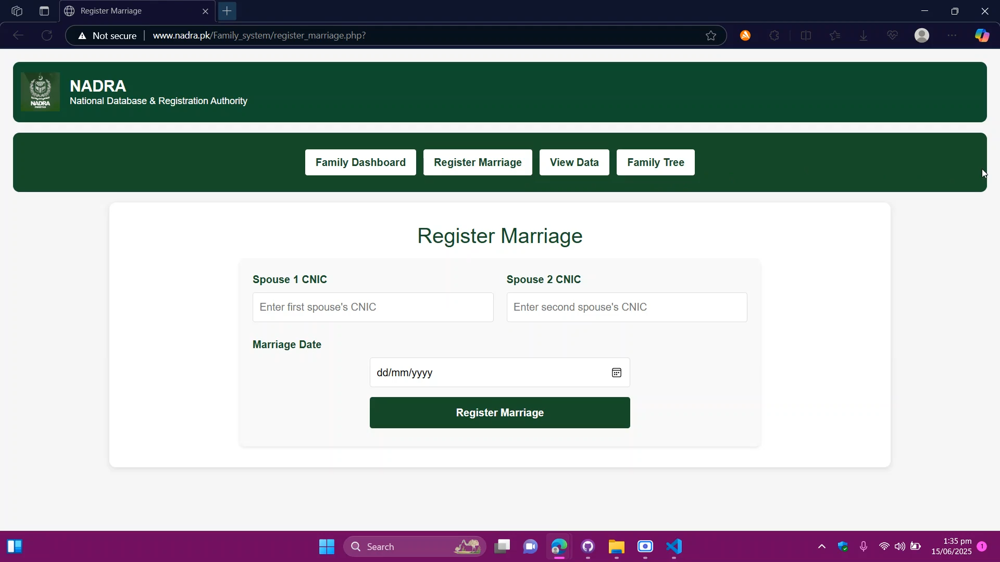
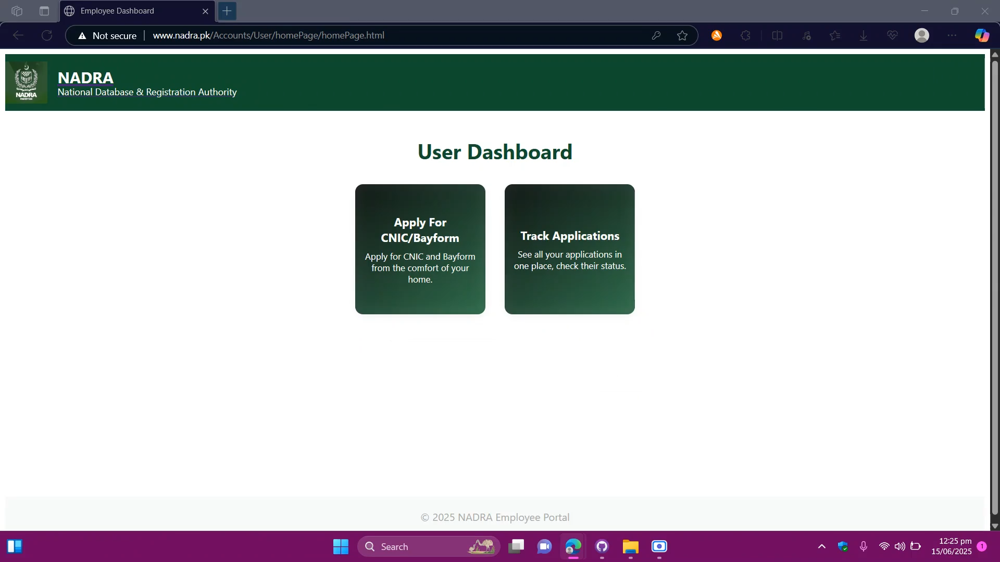
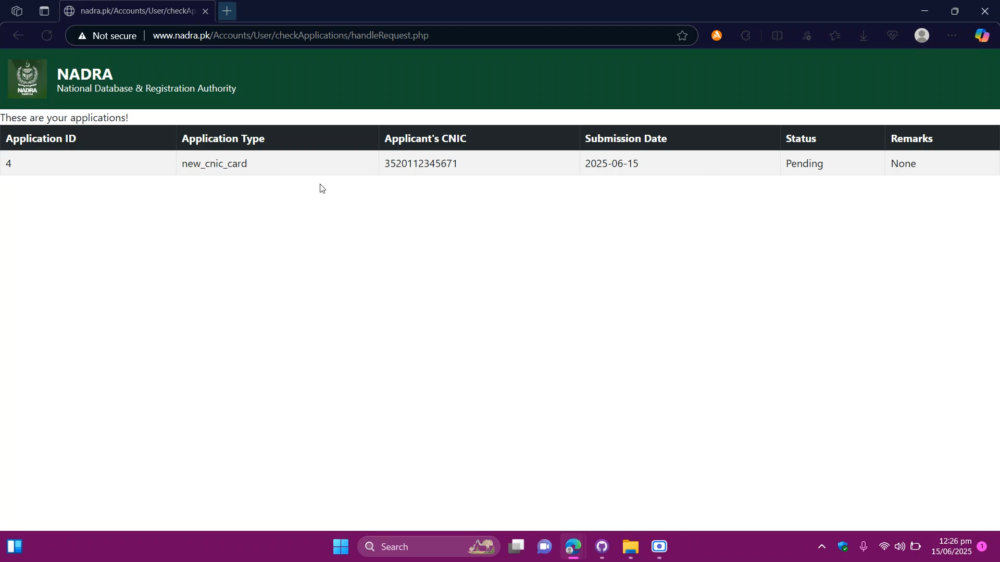

# National-Database-and-Registration-Authority-Clone
This is my final Semester Project for Database Management System course.

My group cloned National Database and Registeration Authority and brought improvements to the already existing system, which is a system used by Pakistani Government to store and manage data of all its nationals.

Tools & Technologies Used:
    Stack: WAMP
    Programming Languages:
        -> PHP -> Backend
        -> Html, Javascript, CSS -> Frontend
    Other tools:
        -> Bootstrap -> Frontend

Screenshots
Login Page:

Employee End:

Birth Registration:

Citizen Registration:

Family Tree:

Logs And Records:

Marriage Registration:

User End:

Application Status:

